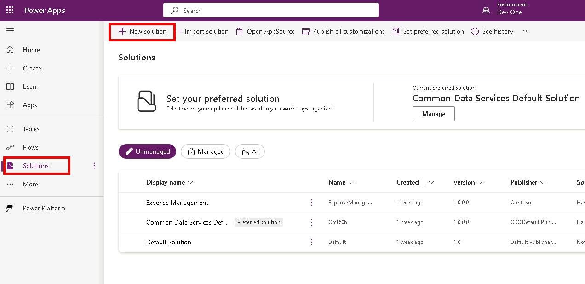
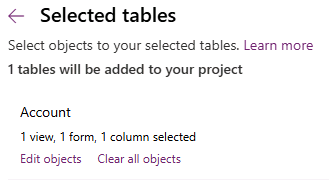

---
lab:
  title: "Labo\_1\_: Serveur de publication et solution"
  module: 'Module 1: Create tables in Dataverse'
---

# Labo pratique 1 : Serveur de publication et solution

## Scénario

Dans ce labo, vous créez un serveur de publication et une solution.

## Contenu du didacticiel

- Comment créer une solution dans Microsoft Dataverse
- Comment ajouter des composants existants à une solution

## Étapes de labo de haut niveau

- Créer un éditeur
- Créer une solution 
- Ajouter une table, une colonne, une vue et un formulaire à la solution
  
## Prérequis

- Vous devez avoir effectué le **Labo 0 : Valider l’environnement de labo**

## Procédure détaillée

## Exercice 1 : Créer un serveur de publication et une solution

Dans cet exercice, vous accédez au portail de création Power Apps, à l’environnement de développement, et créez une solution.

### Tâche 1.1 : Portail de création

1. Dans un nouvel onglet, accédez au portail de création Power Apps `https://make.powerapps.com` et connectez-vous avec vos informations d’identification Microsoft 365 si vous y êtes invité.

1. Si vous êtes invité à entrer un **Numéro de téléphone**, entrez `0123456789` et sélectionnez **Envoyer**.

1. Changez d’environnement en utilisant le Sélecteur d’environnement en haut à droite de l’écran.

1. Sélectionnez l’environnement **Dev One** dans la liste.

    

1. Sélectionnez **Applications** dans le volet de navigation gauche, puis sélectionnez **Tous**. Vous devez voir plusieurs applications, notamment l’application Dataverse Accelerator, Solution Health Hub, et Power Pages Management.

1. Sélectionnez **Tables** dans le volet de navigation gauche. Vous devez voir les tables standard du *Common Data Model*, notamment Compte et Contact.

### Tâche 1.2 : Créer une solution et un serveur de publication

1. Cliquez sur **Solutions** dans le volet de navigation gauche. Vous devez voir plusieurs solutions, notamment la *Solution par défaut* et la *Solution Common Data Services par défaut*.

    

1. Cliquez sur **+ Nouvelle solution**.

1. Dans la zone de texte **Nom d’affichage**, entrez **`Property listings`**

1. Vérifiez que le **Nom** est automatiquement renseigné.

1. Sélectionnez **+ Nouveau serveur de publication** sous la liste déroulante **Serveur de publication**.

1. Pour **Nom d’affichage**, entrez `Contoso Real Estate`

1. Pour **Nom**, entrez `contosorealestate`

1. Pour **Préfixe**, entrez `cre`

    

1. Sélectionnez **Enregistrer**.

1. Dans la liste déroulante **Serveur de publication**, sélectionnez **Contoso Real Estate (contosorealestate)**.

1. Sélectionnez **Créer**.

    

## Exercice 2 : Ajouter des composants à la solution

Dans cet exercice, vous ajoutez une table existante à la solution.

### Tâche 2.1 : Ajouter une table

1. Accédez au portail de création Power Apps `https://make.powerapps.com`

1. Vérifiez que vous êtes dans l’environnement **Dev One**.

1. Cliquez sur **Solutions**.

1. Sélectionnez la solution **Contoso Real Estate** de l’exercice précédent.

    

1. Sélectionnez **Ajouter** et choisissez **Table**.

    

1. Sélectionnez la table **Compte**.

    

1. Cliquez sur **Suivant**.

1. Sous la table **Compte**, sélectionnez le lien **Sélectionner des objets**.

1. Sous l’onglet **Colonnes**, sélectionnez la colonne **Numéro de compte**.

1. Sélectionnez l’onglet **Vues**.

1. Sélectionnez la vue **Comptes actifs**.

1. Sélectionnez l’onglet **Formulaires**.

1. Sélectionnez le formulaire **Account**.

1. Sélectionnez **Ajouter**.

    > **Remarque :** Vous devez avoir sélectionné 1 vue, 1 formulaire et 1 colonne pour la table **Compte**.

    

1. Sélectionnez **Ajouter**.
