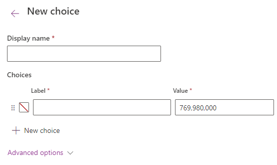

---
lab:
  title: "Labo\_2\_: Modèle de données"
  module: 'Module 1: Create tables in Dataverse'
---

# Travaux pratiques du labo 2 - Modèle de données

## Scénario

Dans ce labo, vous allez créer des tables, des colonnes et des relations Dataverse.

Contoso Real Estate souhaite suivre deux éléments clés :

- Annonces immobilières
- Qui est prévu pour faire visiter les biens immobiliers

## Contenu du didacticiel

- Comment créer des tables dans Dataverse
- Comment ajouter des colonnes à des tables Dataverse
- Comment créer des relations entre les tables

## Étapes de labo de haut niveau

- Créer des tables
- Créer des colonnes
- Créer des relations
  
## Prérequis

- Vous devez avoir suivi le **Labo 1 : Éditeur et solution**

## Procédure détaillée

## Exercice 1 – Créer des tables

Dans cet exercice, vous allez créer et ajouter des tables à la solution.

### Tâche 1.1 – Créer une table Real Estate Property

1. Accédez au portail Power Apps Maker `https://make.powerapps.com`

1. Vérifiez que vous êtes dans l’environnement **Dev One**.

1. Cliquez sur **Solutions**.

1. Ouvrez la solution **Annonces immobilières**.

1. Sélectionnez **+ Nouveau**, **Table**, puis **Définir les propriétés avancées**.

    

1. Entrez `Real Estate Property` comme **Nom d’affichage**. Le nom au pluriel est automatiquement renseigné.

1. Cliquez sur l’onglet **Colonne principale**.

1. Entrez `Property Name` comme **Nom d’affichage**.

1. Développez **Options avancées**, passez en revue les options disponibles, mais ne modifiez rien ici.

    

1. Sélectionnez l’onglet **Propriétés**.

1. Développez **Options avancées**.

1. Cochez **Création d’une activité**.

1. Cochez **Afficher dans les résultats de recherche**.

    

1. Sélectionnez **Enregistrer**.

### Tâche 1.2 – Créer une table Showing

1. Dans le volet **Objets**, sélectionnez **Tous**.

1. Sélectionnez **+ Nouveau**, **Table**, puis **Définir les propriétés avancées**.

1. Entrez `Showing` comme **Nom d’affichage**. Le nom au pluriel est automatiquement renseigné.

1. Développez **Options avancées**.

1. Cochez **Afficher dans les résultats de recherche**.

1. Sélectionnez **Enregistrer**.

### Tâche 1.3 – Créer une table Open House

1. Dans le volet **Objets**, sélectionnez **Tous**.

1. Sélectionnez **+ Nouveau**, **Table**, puis **Définir les propriétés avancées** à nouveau.

1. Entrez `Open House` comme **Nom d’affichage**. Le nom au pluriel est automatiquement renseigné.

1. Développez **Options avancées**.

1. Sélectionnez **Organisation** pour **Propriété des enregistrements**.

1. Sélectionnez **Enregistrer**.

### Tâche 1.4 – Ajouter une table Contact

1. Dans le volet **Objets**, sélectionnez **Tous**.

1. Sélectionnez **Ajouter l’existant** et choisissez **Table**.

1. Sélectionnez la table **Contact**.

1. Cliquez sur **Suivant**.

1. Sélectionnez **Ajouter**.

## Exercice 2 – Créer des colonnes

Dans cet exercice, vous allez créer des colonnes dans les tables de la solution.

### Tâche 2.1 – Créer des colonnes Real Estate Property

1. Accédez au portail Power Apps Maker `https://make.powerapps.com`

1. Vérifiez que vous êtes dans l’environnement **Dev One**.

1. Cliquez sur **Solutions**.

1. Ouvrez la solution **Annonces immobilières**.

1. Sélectionnez la table **Real Estate Property**.

1. Sélectionnez **Propriétés**.

    

1. Cochez **Activer les pièces jointes** et sélectionnez **Enregistrer**.

1. En dessous de **Schéma**, sélectionner **Colonnes**.

1. Cliquez sur **+ Nouvelle colonne**.

    

1. Entrez `Asking Price` comme **Nom d’affichage**.

1. Sélectionnez **Devise** dans la liste déroulante **Type de données**.

1. Dans la liste déroulante **Requis**, sélectionnez **Entreprise requise**.

1. Sélectionnez **Enregistrer**.

1. Sélectionnez **+ Nouvelle colonne**.

1. Entrez `Street` comme **Nom d’affichage**.

1. Dans la liste déroulante **Requis**, sélectionnez **Entreprise requise**.

1. Sélectionnez **Enregistrer**.

1. Sélectionnez **+ Nouvelle colonne**.

1. Entrez `City` comme **Nom d’affichage**.

1. Dans la liste déroulante **Requis**, sélectionnez **Entreprise requise**.

1. Sélectionnez **Enregistrer**.

1. Sélectionnez **+ Nouvelle colonne**.

1. Entrez `Bedrooms` comme **Nom d’affichage**.

1. Sélectionnez **Choix** dans la liste déroulante **Type de données**, puis sélectionnez **Choix** une nouvelle fois.

    

1. Sélectionnez **Oui** pour **Synchroniser avec le choix global**.

1. Sélectionnez **+ Nouveau choix**.

    

1. Entrez `Number of Rooms` comme **Nom d’affichage**.

1. Entrez `1` pour **Étiquette** et `1` pour **Valeur**.

1. Sélectionnez **+ Nouveau choix**, puis entrez `2` pour **Étiquette** et `2` pour **Valeur**.

1. Sélectionnez **+ Nouveau choix**, puis entrez `3` pour **Étiquette** et `3` pour **Valeur**.

1. Sélectionnez **+ Nouveau choix**, puis entrez `4` pour **Étiquette** et `4` pour **Valeur**.

1. Sélectionnez **+ Nouveau choix**, puis entrez `5` pour **Étiquette** et `5` pour **Valeur**.

    

1. Sélectionnez **Enregistrer**.

1. Dans **Synchroniser ce choix avec**, sélectionnez **Nombre de pièces**.

1. Sélectionnez **Enregistrer**.

1. Sélectionnez **+ Nouvelle colonne**.

1. Entrez `Bathrooms` comme **Nom d’affichage**.

1. Sélectionnez **Choix** dans la liste déroulante **Type de données**, puis sélectionnez **Choix** une nouvelle fois.

1. Dans **Synchroniser ce choix avec**, sélectionnez **Nombre de pièces**.

1. Sélectionnez **Enregistrer**.

### Tâche 2.2 – Créer des colonnes Showing

1. Dans le volet **Objets**, sélectionnez **Tous**.

1. Sélectionnez la table **Showing**.

1. En dessous de **Schéma**, sélectionner **Colonnes**.

1. Sélectionnez **+ Nouvelle colonne**.

1. Entrez `Showing Date` comme **Nom d’affichage**.

1. Sélectionnez **Date et heure** dans la liste déroulante **Type de données**.

1. Sélectionnez **Date uniquement** dans la liste déroulante **Format**.

1. Dans la liste déroulante **Requis**, sélectionnez **Entreprise requise**.

1. Sélectionnez **Enregistrer**.

1. Sélectionnez **+ Nouvelle colonne**.

1. Entrez `Comments` comme **Nom d’affichage**.

1. Sélectionnez **Texte** dans la liste déroulante **Type de données**, puis sous **Plusieurs lignes de texte**, sélectionnez **Texte brut**.

1. Cliquez sur **Enregistrer**.

1. Sélectionnez **+ Nouvelle colonne**.

1. Entrez `Level of Interest` comme **Nom d’affichage**.

1. Sélectionnez **Choix** dans la liste déroulante **Type de données**, puis sélectionnez **Choix** une nouvelle fois.

1. Sélectionnez **Non** pour **Synchroniser avec le choix global**.

1. Entrez `Very High` pour **Étiquette**.

1. Sélectionnez **+ Nouveau choix**, puis entrez `High` pour **Étiquette**.

1. Sélectionnez **+ Nouveau choix**, puis entrez `Medium` pour **Étiquette**.

1. Sélectionnez **+ Nouveau choix**, puis entrez `Low` pour **Étiquette**.

1. Sélectionnez **+ Nouveau choix**, puis entrez `No interest` pour **Étiquette**.

1. Sélectionnez **Enregistrer**.

1. Sélectionnez **+ Nouvelle colonne**.

1. Entrez `Shown by` comme **Nom d’affichage**.

1. Sélectionnez **Recherche** dans la liste déroulante **Type de données**, puis sélectionnez **Recherche** une nouvelle fois.

1. Dans la liste déroulante **Table associée**, sélectionnez **Utilisateur**.

1. Sélectionnez **Enregistrer**.

### Tâche 2.3 – Créer des colonnes Open House

1. Dans le volet **Objets**, sélectionnez **Tous**.

1. Sélectionnez la table **Open House**.

1. En dessous de **Schéma**, sélectionner **Colonnes**.

1. Sélectionnez **+ Nouvelle colonne**.

1. Entrez `Open House Date` comme **Nom d’affichage**.

1. Sélectionnez **Date et heure** dans la liste déroulante **Type de données**.

1. Sélectionnez **Date uniquement** dans la liste déroulante **Format**.

1. Dans la liste déroulante **Requis**, sélectionnez **Entreprise requise**.

1. Sélectionnez **Enregistrer**.

## Exercice 3 – Créer des relations

Dans cet exercice, vous allez créer des relations entre les tables de la solution.

### Tâche 3.1 – Relation entre Real Estate Property et Contact

1. Accédez au portail Power Apps Maker `https://make.powerapps.com`

1. Vérifiez que vous êtes dans l’environnement **Dev One**.

1. Cliquez sur **Solutions**.

1. Ouvrez la solution **Annonces immobilières**.

1. Sélectionnez la table **Real Estate Property**.

1. Sous **Schéma**, sélectionnez **Relations**.

1. Sélectionnez **+ Nouvelle relation**, puis **Plusieurs-à-un**.

1. Dans la liste déroulante **Table associée (une)**, sélectionnez **Contact**.

1. Entrez `Client` pour **Nom d’affichage de la colonne de recherche**.

1. Dans la liste déroulante **Exigences de la colonne de recherche**, sélectionnez **Entreprise requise**.

1. Cliquez sur **Terminé**.

### Tâche 3.2 – Relation entre Real Estate Property et Showing

1. Sélectionnez **+ Nouvelle relation**, puis **Un-à-plusieurs**.

1. Dans la liste déroulante **Table associée (plusieurs)**, sélectionnez **Showing**.

1. Dans la liste déroulante **Exigences de la colonne de recherche**, sélectionnez **Entreprise requise**.

1. Cliquez sur **Terminé**.

### Tâche 3.3 – Relation entre Real Estate Property et Open House

1. Sélectionnez **+ Nouvelle relation**, puis **Un-à-plusieurs**.

1. Dans la liste déroulante **Table associée (plusieurs)**, sélectionnez **Open House**.

1. Dans la liste déroulante **Exigences de la colonne de recherche**, sélectionnez **Entreprise requise**.

1. Développez **Général**.

1. Entrez `realestateproperty_openhouse` dans **nom de la relation**.

1. Cliquez sur **Terminé**.

### Tâche 3.4 – Relation entre Showing et Contact

1. Dans le volet **Objets**, sélectionnez **Tous**.

1. Sélectionnez la table **Showing**.

1. Sous **Schéma**, sélectionnez **Relations**.

1. Sélectionnez **+ Nouvelle relation**, puis **Plusieurs-à-un**.

1. Dans la liste déroulante **Table associée (une)**, sélectionnez **Contact**.

1. Entrez `Shown to` pour **Nom d’affichage de la colonne de recherche**.

1. Cliquez sur **Terminé**.

