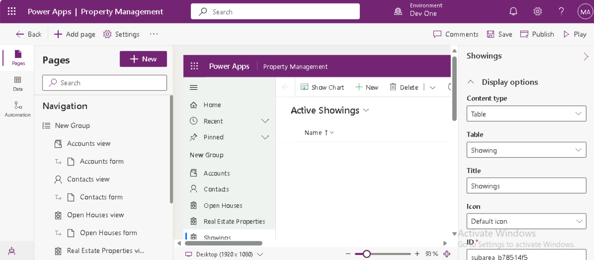

---
lab:
  title: "Labo 3\_: Créer une application pilotée par modèle"
  module: 'Module 2: Get started with model-driven apps in Power Apps'
---

# Labo pratique 3 : Créer une application pilotée par modèle

## Scénario

Dans ce labo, vous créerez une application pilotée par modèle et ajouterez des tables à l’application.

Contoso Real Estate souhaite suivre deux éléments clés :

- Annonces immobilières
- Qui est prévu pour faire visiter les biens immobiliers

## Contenu du didacticiel

- Comment créer une application pilotée par modèle
- Comment ajouter des tables à l’application

## Étapes de labo de haut niveau

- Créer une application pilotée par modèle
- Ajouter des tables à l’application
  
## Prérequis

- Doit avoir complété le **Labo 2 : Modèle de données**

## Procédure détaillée

## Exercice 1 : Créer une application pilotée par modèle

Dans cet exercice, vous créerez une application pilotée par modèle.

### Tâche 1.1 : Créer une application Gestion des propriétés

1. Accéder au portail Power Apps Maker `https://make.powerapps.com`

1. Vérifiez que vous êtes dans l’environnement **Dev One**.

1. Cliquez sur **Solutions**.

1. Ouvrez la solution **Annonces immobilières**.

1. Sélectionnez **+ Nouveau**, puis sélectionnez **Application**, puis **Application pilotée par modèle**.

    

1. Entrez `Property Management` pour **Nom**.

1. Sélectionnez **Créer**.

    

### Tâche 1.2 : Ajouter des tables

1. Cliquez sur **+ Ajouter une page**.

    

1. Sélectionnez **Table Dataverse**.

1. Entrez `cre` dans **Rechercher**.

    

1. Sélectionnez **Portes ouvertes**, **Propriété immobilière**, puis **Visites**.

1. Entrez `account` dans **Rechercher**, puis sélectionnez **Compte**.

1. Entrez `contact` dans **Rechercher**, puis sélectionnez **Contact**.

1. Sélectionnez **Ajouter**.

    

1. Sélectionnez **Enregistrer**.

1. Cliquez sur **Publier**.

### Tâche 1.3 : Test

1. Lorsque le concepteur d’applications **Gestion des propriétés** s’ouvre, sélectionnez le bouton **Lecture**.

1. Accédez aux **Contacts**.

1. Cliquez sur **+ Nouveau**.

1. Entrez `Jon` pour le **Prénom**.

1. Entrez `Doe` pour le **Nom de famille**

1. Cliquez sur **Enregistrer et fermer**.

1. Accéder aux **Propriétés immobilières**

1. Cliquez sur **+ Nouveau**.

1. Entrez `Test Property` pour le **Nom de la propriété**.

1. Sélectionnez **Enregistrer**.

1. Sélectionnez **Associé**, puis **Visites**.

    

1. Sélectionnez **+ Nouvelle visite**.

1. Entrez `First Showing` pour **Nom**.

1. Cliquez sur **Enregistrer et fermer**.

1. Sélectionnez **Enregistrer et fermer**.

