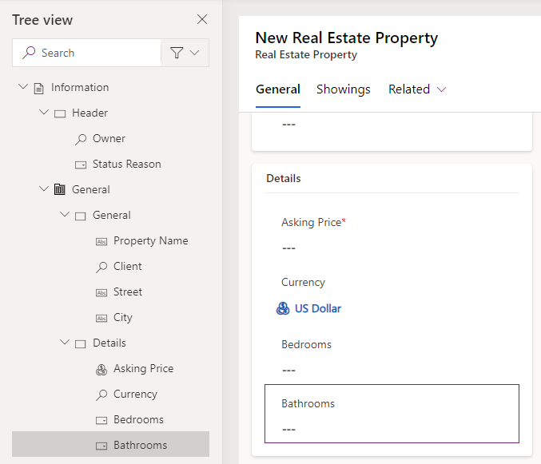
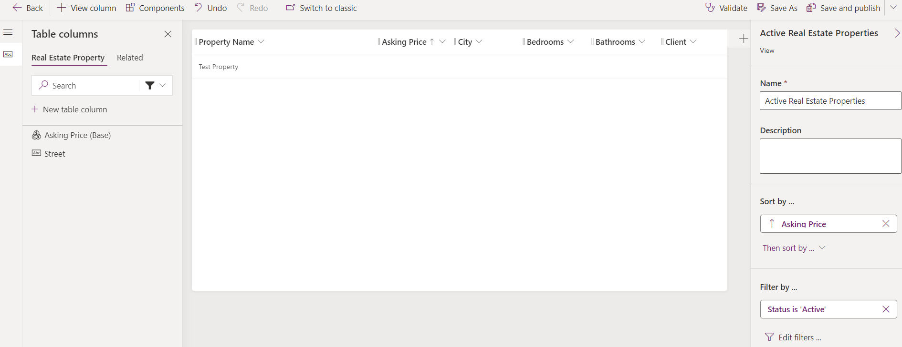

---
lab:
  title: "Labo\_4\_: Configurer des formulaires et des vues"
  module: 'Module 3: Configure forms, charts, and dashboards in model-driven apps'
---

# Travaux pratiques du labo 4 - Configurer des formulaires et des vues

## Scénario

Dans ce labo, vous allez configurer des formulaires et des vues pour une application pilotée par des modèles.

Contoso Real Estate souhaite suivre deux éléments clés :

- Annonces immobilières
- Qui est prévu pour faire visiter les biens immobiliers

## Contenu du didacticiel

- Comment configurer des formulaires de table
- Comment configurer des vues de table

## Étapes de labo de haut niveau

- Configurer le formulaire principal Bien immobilier et visite
- Configurer des onglets et des sections
- Ajouter des colonnes aux formulaires
- Ajouter une sous-grille
- Créer un nouveau formulaire
- Associer des rôles de sécurité aux formulaires
- Configurer des vues Bien immobilier et visite
- Filtrer les vues
- Configurer la vue Recherche rapide
  
## Prérequis

- Doit avoir complété le **Labo 2 : Modèle de données**

## Procédure détaillée

## Exercice 1 - Formulaire principal Real Estate Property

Dans cet exercice, vous allez modifier le formulaire principal pour la table Real Estate Property.

### Tâche 1.1 – Disposition et colonnes du formulaire principal

1. Accédez au portail Power Apps Maker `https://make.powerapps.com`

1. Vérifiez que vous êtes dans l’environnement **Dev One**.

1. Cliquez sur **Solutions**.

1. Ouvrez la solution **Annonces immobilières**.

1. Sélectionnez la table **Real Estate Property**.

1. Sous **Expériences de données**, sélectionnez **Formulaires**.

1. Sélectionnez le formulaire **Information** dans lequel le **Type de formulaire** est **Principal**. Sélectionnez le menu **Commandes** (...), puis sélectionnez **Modifier** > **Modifier dans un nouvel onglet**.

1. Sélectionnez **Arborescence** sur le côté gauche du concepteur de formulaires.

1. Cliquez sur l’onglet **Général**.

1. Entrez `generalTab` pour **Nom**.

1. Dans le volet **Biens** à droite, sélectionnez **3 colonnes** dans la liste déroulante **Disposition**.

    

1. Dans **Arborescence**, développez l’onglet **Général**. Sélectionnez la première section et entrez `generalSection` pour **Nom**.

1. Sélectionnez la deuxième section et entrez `Timeline` pour **Étiquette** et `timelineSection` pour **Nom**.

1. Sélectionnez la troisième section et entrez `Related` pour **Étiquette** et `relatedSection` pour **Nom**.

1. Faites glisser le champ **Propriétaire** dans la zone **En-tête**.

    

1. Sélectionnez la première section.

1. Sélectionnez **Colonnes de table** dans le volet de navigation de gauche dans le concepteur de formulaires.

1. Faites glisser la colonne **Client** sous le champ **Nom de la propriété**.

1. Sélectionnez la colonne **Rue** à ajouter au formulaire sous **Client**.

1. Sélectionnez la colonne **Ville** à ajouter au formulaire sous **Rue**.

1. Sélectionnez **Composants** dans le volet de navigation de gauche dans le concepteur de formulaires.

1. Sélectionnez le contrôle **Section à 1 colonne** pour l’ajouter au formulaire.

1. Entrez `Details` pour **Étiquette** et `detailsSection` pour **Nom**.

1. Sélectionnez **Colonnes de table** dans le volet de navigation de gauche dans le concepteur de formulaires.

1. Sélectionnez la colonne **Prix demandé** à ajouter à la section Détails.

1. Sélectionnez la colonne **Devise** à ajouter au formulaire sous **Prix demandé**.

1. Sélectionnez la colonne **Chambres** à ajouter au formulaire sous **Devise**.

1. Sélectionnez la colonne **Salles de bains** à ajouter au formulaire sous **Chambres**.

    

### Tâche 1.2 – Ajouter un contrôle Chronologie

1. Sélectionnez **Arborescence** dans le volet de navigation de gauche dans le concepteur de formulaires.

1. Sélectionnez la section **Chronologie**.

1. Sélectionnez **Composants** dans le volet de navigation de gauche dans le concepteur de formulaires.

1. Développez **Affichage**.

1. Sélectionnez le contrôle **Chronologie** pour l’ajouter à la section **Chronologie**.

1. Sélectionnez **Arborescence** dans le volet de navigation de gauche dans le concepteur de formulaires, développez l’onglet **Général**, puis sélectionnez la section **Chronologie**.

1. Dans le volet **Propriétés** à droite, cochez la case **Masquer l’étiquette**.

    

1. Dans l’**Arborescence**, sélectionnez le contrôle **Texte de la note** pour la chronologie.

1. Dans le volet **Propriétés** à droite, sélectionnez **Activité sociale**, décochez la case **Activer**, puis sélectionnez **Terminé**.

1. Dans le volet **Propriétés** à droite, sélectionnez **Date créée** dans la liste déroulante **Trier les activités par**.

1. Sélectionnez **Colonnes de table** dans le volet de navigation de gauche dans le concepteur de formulaires.

1. Faites glisser la colonne **Motif de l’état** dans la zone **En-tête**.

### Tâche 1.3 – Ajouter un contrôle Aperçu

1. Sélectionnez **Arborescence** sur le côté gauche du concepteur de formulaires.

1. Sélectionnez la section **Associé**.

1. Sélectionnez **Composants** dans le volet de navigation de gauche du concepteur de formulaires.

1. Développez **Affichage**.

1. Sélectionnez le contrôle **Aperçu** pour l’ajouter à la section **Associé**.

1. Sélectionnez **Client** pour **Recherche** et **carte de contact de compte** pour **Contact**, puis sélectionnez **Terminé**.

### Tâche 1.4 – Ajouter un onglet

1. Sélectionnez **Composants** dans le volet de navigation de gauche du concepteur de formulaires.

1. Sélectionnez le contrôle **Onglet à 1 colonne** pour l’ajouter au formulaire.

1. Entrez `Showings` pour **Étiquette** et `showingTab` pour **Nom**.

1. Sélectionnez **Arborescence** sur le côté gauche du concepteur de formulaires, développez **Visites**, puis sélectionnez la section **Nouvelle section**.

1. Entrez `Showings` pour **Étiquette** et `showingSection` pour **Nom**.

1. Sélectionnez **Composants** dans le volet de navigation de gauche du concepteur de formulaires.

1. Développez **Grille**.

1. Sélectionnez le contrôle **Sous-grille** pour l’ajouter à la section **Visites** .

1. Sélectionnez **Afficher les enregistrements associés**.

1. Sélectionnez **Showings (Real Estate Property)** pour **Table** et **Visites actives** pour **Vue par défaut**, puis sélectionnez **Terminé**.

1. Entrez `Showings` pour **Étiquette** et `showingsSG` pour **Nom**.

1. Sélectionnez **Masquer l’étiquette**.

1. Cliquez sur **Enregistrer et publier**.

1. **Fermez** le concepteur de formulaires.

1. Cliquez sur **Terminé**.

## Exercice 2 - Formulaire principal Showing

Dans cet exercice, vous allez modifier le formulaire principal pour la table Showing.

### Tâche 2.1 – Disposition et colonnes du formulaire principal

1. Accédez au portail Power Apps Maker `https://make.powerapps.com`

1. Vérifiez que vous êtes dans l’environnement **Dev One**.

1. Cliquez sur **Solutions**.

1. Ouvrez la solution **Annonces immobilières**.

1. Sélectionnez la table **Showing**.

1. Sous **Expériences de données**, sélectionnez **Formulaires**.

1. Sélectionnez le formulaire **Information** dans lequel le **Type de formulaire** est **Principal**. Sélectionnez le menu **Commandes** (...), puis sélectionnez **Modifier** > **Modifier dans un nouvel onglet**.

1. Faites glisser le champ **Propriétaire** dans la zone **En-tête**.

1. Sélectionnez **Colonnes de table** dans le volet de navigation de gauche dans le concepteur de formulaires.

1. Faites glisser la colonne **Bien immobilier** sous le champ **Nom**.

1. Sélectionnez la colonne **Montré à** à ajouter au formulaire sous **Bien immobilier**.

1. Sélectionnez la colonne **Montré par** à ajouter au formulaire sous **Montré à**.

1. Sélectionnez la colonne **Date de la visite** à ajouter au formulaire sous **Montré par**.

1. Sélectionnez la colonne **Niveau d’intérêt** à ajouter au formulaire sous **Date de la visite**.

1. Sélectionnez la colonne **Commentaires** à ajouter au formulaire sous **Niveau d’intérêt**.

1. Dans le volet **Biens** à droite, augmentez la **Hauteur de champ du formulaire** en la définissant sur **3 lignes**.

1. Cliquez sur **Enregistrer et publier**.

1. **Fermez** le concepteur de formulaires.

1. Cliquez sur **Terminé**.

## Exercice 3 - Formulaires multiples

Dans cet exercice, vous allez créer un formulaire et restreindre l’accès avec un rôle de sécurité.

### Tâche 3.1 – Rôle de sécurité

1. Accédez au portail Power Apps Maker `https://make.powerapps.com`

1. Vérifiez que vous êtes dans l’environnement **Dev One**.

1. Cliquez sur **Solutions**.

1. Ouvrez la solution **Annonces immobilières**.

1. Sélectionnez successivement **+ Nouveau**, **Sécurité**, puis **Rôle de sécurité**.

1. Entrez `Property admin` pour **Nom du rôle**.

1. Sélectionnez l’**unité commerciale**, puis enregistrez.

1. Faites défiler jusqu’à la section **Tables personnalisées**.

1. Sélectionnez la table **Real Estate Property**. Remplacez le niveau d’accès sur tous les privilèges par **Organisation**.

    

1. Sélectionnez la table **Showing**. Remplacez le niveau d’accès sur tous les privilèges par **Organisation**.

1. Sélectionnez **Enregistrer et fermer**.

1. Cliquez sur **Terminé**.

### Tâche 3.2 – Copier le formulaire

1. Sélectionnez la table **Showing**.

1. Sous **Expériences de données**, sélectionnez **Formulaires**.

1. Sélectionnez le formulaire **Information** dans lequel le **Type de formulaire** est **Principal**. Sélectionnez le menu **Commandes** (...), puis sélectionnez **Modifier** > **Modifier dans un nouvel onglet**.

1. Sélectionnez **Niveau d’intérêt**, puis dans le volet Propriétés, sélectionnez **Lecture seule**.

1. Sélectionnez **Commentaires**, puis dans le volet Propriétés, sélectionnez **Lecture seule**.

1. Sélectionnez **Enregistrer une copie**.

1. Entrez `Showing admin form` comme **Nom d’affichage** et sélectionnez **Enregistrer**.

    

1. Sélectionnez **Paramètres du formulaire**.

1. Sélectionnez le rôle de sécurité **Administrateur de propriété**.

    

1. Cliquez sur **Enregistrer et publier**.

1. **Fermez** le concepteur de formulaires.

1. Cliquez sur **Terminé**.

## Exercice 4 - Vues Real Estate Property

Dans cet exercice, vous allez modifier les vues pour la table Real Estate Property.

### Tâche 4.1 – Vue publique Real Estate Property

1. Accédez au portail Power Apps Maker `https://make.powerapps.com`

1. Vérifiez que vous êtes dans l’environnement **Dev One**.

1. Cliquez sur **Solutions**.

1. Ouvrez la solution **Annonces immobilières**.

1. Sélectionnez la table **Real Estate Property**.

1. Sous **Expériences de données**, sélectionnez **Vues**.

1. Sélectionnez successivement la vue **Biens immobiliers actifs**, le menu **Commandes** (...), puis **Modifier** > **Modifier dans un nouvel onglet**.

1. Sélectionnez l’accent circonflexe à côté de la colonne **Créé le**, puis sélectionnez **Supprimer**.

1. Sélectionnez la colonne **Prix demandé** à ajouter à la vue.

1. Sélectionnez la colonne **Ville** à ajouter à la vue.

1. Sélectionnez la colonne **Chambres** à ajouter à la vue.

1. Sélectionnez la colonne **Salles de bains** à ajouter à la vue.

1. Sélectionnez la colonne **Client** à ajouter à la vue.

1. Dans le volet Biens, supprimez **Nom du bien** sous **Trier par**.

1. Dans le volet Biens, sélectionnez **Trier par** et **Prix demandé**.

    

1. Cliquez sur **Enregistrer et publier**.

1. **Fermer** le concepteur de vues.

1. Cliquez sur **Terminé**.

### Tâche 4.2 – Vue Recherche rapide de biens immobiliers

1. Sélectionnez la vue **Recherche rapide de biens immobilier actifs**, le menu **Commandes** (...), puis **Modifier** > **Modifier dans un nouvel onglet**.

1. Sélectionnez l’accent circonflexe à côté de la colonne **Créé le**, puis sélectionnez **Supprimer**.

1. Dans le volet **Recherche rapide de biens immobiliers actifs** à droite, sélectionnez **Modifier les colonnes de la table de recherche** sous **Rechercher par**.

1. Choisissez les colonnes suivantes et sélectionnez **Appliquer**.

    - Ville
    - Client
    - Nom de la propriété

1. Cliquez sur **Enregistrer et publier**.

1. **Fermer** le concepteur de vues.

1. Cliquez sur **Terminé**.

## Exercice 5 - Vues Showing

Dans cet exercice, vous allez modifier les vues pour la table Showing.

### Tâche 5.1 – Vue publique Showing

1. Accédez au portail Power Apps Maker `https://make.powerapps.com`

1. Vérifiez que vous êtes dans l’environnement **Dev One**.

1. Cliquez sur **Solutions**.

1. Ouvrez la solution **Annonces immobilières**.

1. Sélectionnez la table **Showing**.

1. Sous **Expériences de données**, sélectionnez **Vues**.

1. Sélectionnez successivement la vue **Visites actives**, le menu **Commandes** (...), puis **Modifier** > **Modifier dans un nouvel onglet**.

1. Sélectionnez l’accent circonflexe à côté de la colonne **Créé le**, puis sélectionnez **Supprimer**.

1. Sélectionnez la colonne **Bien immobilier** à ajouter à la vue.

1. Sélectionnez la colonne **Date de la visite** à ajouter à la vue.

1. Sélectionnez la colonne **Montré à** à ajouter à la vue.

1. Sélectionnez la colonne **Niveau d’intérêt** à ajouter à la vue.

1. Sélectionnez l’onglet **Associé**.

1. Développez **Bien immobilier**.

1. Sélectionnez la colonne **Prix demandé** à ajouter à la vue.

1. Dans le volet Biens, supprimez **Nom** sous **Trier par**.

1. Dans le volet Biens, sélectionnez **Trier par** et **Date de la visite**.

1. Dans le menu déroulant **Enregistrer et publier**, sélectionnez **Enregistrer uniquement**.

### Tâche 5.2 – Nouvelle vue Showing

1. Sélectionnez **Enregistrer sous**.

1. Entrez `High Interest showings` pour **Nom**.

1. Sélectionnez **Enregistrer**.

1. Sélectionnez l’accent circonflexe à côté de la colonne **Niveau d’intérêt**, puis sélectionnez **Filtrer par**.

1. Sélectionnez **Égal à** et choisissez **Très élevé** et **Élevé**.

1. Sélectionnez **Appliquer**.

1. Cliquez sur **Enregistrer et publier**.

1. **Fermer** le concepteur de vues.

1. Cliquez sur **Terminé**.
