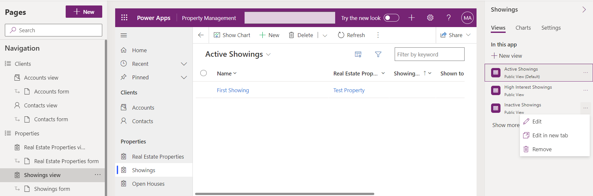

---
lab:
  title: "Labo\_5\_: Configurer une applications pilotée par modèle"
  module: 'Module 3: Configure forms, charts, and dashboards in model-driven apps'
---

# Labo pratique 5 - Configurer une application pilotée par modèle

## Scénario

Dans ce labo, vous allez configurer une application pilotée par modèle.

## Contenu du didacticiel

- Comment configurer la navigation pour une application pilotée par modèle
- Comment restreindre les vues dans une application pilotée par modèle

## Étapes de labo de haut niveau

- Ajouter des groupes à la navigation
- Déplacer des tables dans la navigation
- Restreindre les vues dans l’application
  
## Prérequis

- Avoir suivi **Labo 2 : Modèle de données**, **Labo 3 : Créer une application pilotée par modèle** et **Labo 4 : Configurer des formulaires et des vues**

## Procédure détaillée

## Exercice 1 - Configurer une application pilotée par modèle

Dans cet exercice, vous allez configurer la navigation et les tables d’une application pilotée par modèle.

### Tâche 1.1 - Configurer des groupes

1. Accédez au portail Power Apps Maker <https://make.powerapps.com>.

1. Vérifiez que vous êtes dans l’environnement **Dev One**.

1. Cliquez sur **Solutions**.

1. Ouvrez la solution **Annonces immobilières**.

1. Dans le volet **Objets** sur la gauche, sélectionnez **Applications**.

1. Sélectionnez l’application **Gestion des propriétés**, sélectionnez le menu **Commandes** (...), puis sélectionnez **Modifier** > **Modifier dans un nouvel onglet**.

1. Sélectionnez **Nouveau groupe** dans le volet **Navigation**.

    

1. Dans le volet Propriétés, entrez `Clients` pour **Titre**.

1. Sélectionnez **Navigation**, sélectionnez le menu **Commandes** (...) **...**, puis sélectionnez **Nouveau groupe**.

1. Dans le volet Propriétés, entrez `Properties` pour **Titre**.

1. Dans le **volet de navigation**, sélectionnez la vue **Visites**, sélectionnez le menu **Commandes** (...), puis sélectionnez **Déplacer vers le bas**.

1. Dans le **volet de navigation**, sélectionnez la vue **Biens immobiliers**, sélectionnez le menu **Commandes** (...), puis sélectionnez **Déplacer vers le bas**.

1. Dans le **volet de navigation**, sélectionnez la vue **Portes ouvertes**, sélectionnez le menu **Commandes** (...), puis sélectionnez **Déplacer vers le bas** à trois reprises.

    

### Tâche 1.2 - Restreindre des vues

1. Dans le **volet de navigation**, sélectionnez la vue **Visites**.

1. Dans le volet **Visites**, sélectionnez l’onglet **Vues**.

1. Sélectionnez la vue **Visites inactives**, dans le volet droit, sélectionnez le menu **Commandes** (...), puis sélectionnez **Supprimer**.

    

1. Sélectionnez **Enregistrer**.

1. Cliquez sur **Publier**.

1. **Fermez** le concepteur d’application, puis sélectionnez **Terminé**.

