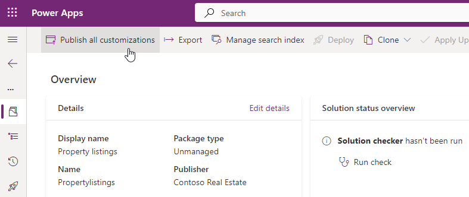

---
lab:
  title: "Labo\_6\_: Exporter la solution"
  module: 'Module 4: Manage solutions in Power Apps and Power Automate'
---

# Travaux pratiques du labo 6 - Exporter la solution

## Scénario

Dans ce labo, vous allez exporter la solution

## Contenu du didacticiel

- Comment exporter une solution Microsoft Dataverse

## Étapes de labo de haut niveau

- Publier les personnalisations
- Exécuter le vérificateur de solution
- Exporter la solution
  
## Prérequis

- Vous devez avoir suivi le **Labo 5 : Configurer une application pilotée par les modèles**

## Procédure détaillée

## Exercice 1 - Exporter la solution

Dans cet exercice, vous allez exporter la solution à partir de l’environnement de développement.

### Tâche 1.1 – Publier les modifications

1. Accédez au portail Power Apps Maker `https://make.powerapps.com`

1. Vérifiez que vous êtes dans l’environnement **Dev One**.

1. Cliquez sur **Solutions**.

1. Sélectionnez la solution **Annonces immobilières**.

1. Dans la solution, sélectionnez l’onglet **Vue d’ensemble**.

    

1. Sélectionnez **Publier toutes les personnalisations**.

### Tâche 1.2 – Vérificateur de solution

1. Dans la solution, sélectionnez l’onglet **Vue d’ensemble**.

1. Sélectionnez **Exécuter la vérification** sous **Vue d’ensemble de l’état de la solution**.

1. Attendez quelques minutes que le vérificateur de solution ait terminé.

    

1. Vous ne devriez voir aucun avertissement ni aucune erreur.

### Tâche 1.3 – Exporter une solution managée

1. Sélectionnez **Exporter**.

1. Cliquez sur **Suivant**.

1. Cliquez à nouveau sur **Suivant**.

1. Le numéro de version devrait être incrémenté à **1.0.0.1**.

    

1. Sélectionnez **Managée** pour **Exporter en tant que**.

1. Sélectionnez **Exporter**.

1. L’exportation est préparée en arrière-plan. Une fois que la solution est prête, sélectionnez le bouton **Télécharger**.

### Tâche 1.4 – Exporter une solution non managée

1. Sélectionnez **Exporter**.

1. Cliquez sur **Suivant**.

1. Cliquez à nouveau sur **Suivant**.

1. Le numéro de version devrait être incrémenté à **1.0.0.2**.

1. Remplacez le numéro de version par `1.0.0.1`

1. Sélectionnez **Non managée** pour **Exporter en tant que**.

1. Sélectionnez **Exporter**.

1. L’exportation est préparée en arrière-plan. Une fois que la solution est prête, sélectionnez le bouton **Télécharger**.

